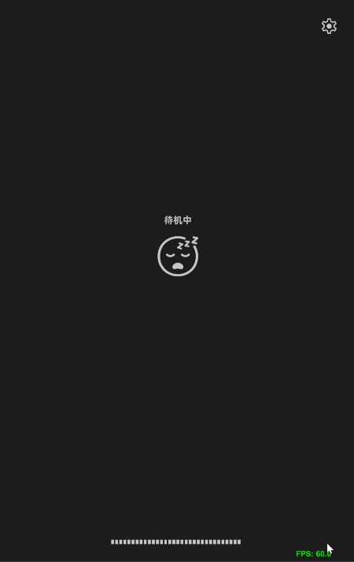
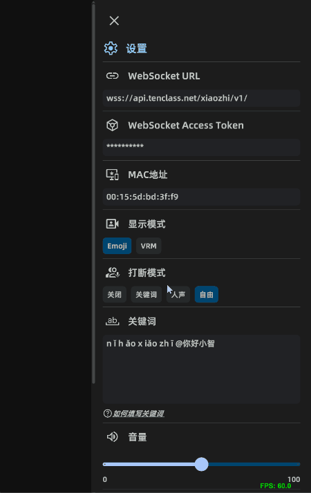
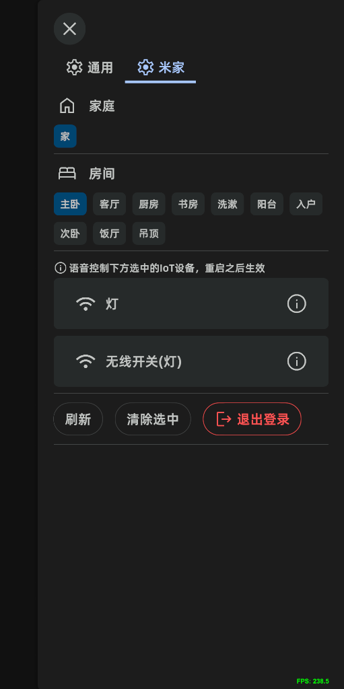

# xiaozhi-unity

基于虾哥的[xiaozhi-esp32](https://github.com/78/xiaozhi-esp32)项目的Unity版本。

  
  

  

## 主要功能

- 集成MIoT，语音控制米家设备
- 小智语音聊天
- 表现模式：
  - Emoji表情
  - VRM模型
- 语音打断模式：
  - 关键词 (关键词打断-->下一轮对话)
  - 人声 (VAD打断-->延时1s-->下一轮对话)
  - 自由 (VAD打断-->无中断对话)
- 可配置唤醒词/关键词
- 两种主题切换
- 提供自定义配置

## 支持平台

| 平台/架构 | x64 | arm64 | arm32 |
|-----------|----|----|----|
| Windows   | ✅ | -- | -- |
| Linux     | ⚠️ | -- | -- |
| MacOS     | ⚠️ | ⚠️ | -- |
| Android   | -- | ✅ | ✅ |
| iOS       | -- | ⚠️ | -- |

✅ 已支持  
⚠️ 支持但未测试  

## 如何实现

- 使用FMOD进行音频录制和播放
- 集成WebRTC APM模块进行音频前处理，支持回声消除，噪声抑制，音频增强
- 集成sherpa-onnx进行实时语音识别，包括VAD和Keyword Spot检测
- 集成VRM1.0
- 使用uLipSync实现口型同步

## 工具

如何构建: 选中Assets/Settings/BuildPresets.asset，在EditorView中即可看到构建界面

导入VRM: 将VRM模型导入Unity之后，Project窗口右键模型选择菜单VRM10/PreProcess进行预处理，最后在Settings/AppPreset.asset中配置VRM Character Model

*注: Settings/AppPreset.asset基本包含了预设的所有配置*

## Reference

- [xiaozhi-esp32](https://github.com/78/xiaozhi-esp32)
- [FMOD](https://github.com/fmod/fmod-for-unity)
- [webrtc audio processing](https://gitlab.freedesktop.org/pulseaudio/webrtc-audio-processing)
- [sherpa-onnx](https://github.com/k2-fsa/sherpa-onnx)
- [uLipSync](https://github.com/hecomi/uLipSync)
- [UniVRM](https://github.com/vrm-c/UniVRM)
- [模型资源](https://hub.vroid.com/en/characters/1245908975744054638/models/2140572620978697176)
- [MiService](https://github.com/Yonsm/MiService)
- [hass-xiaomi-miot](https://github.com/al-one/hass-xiaomi-miot)
